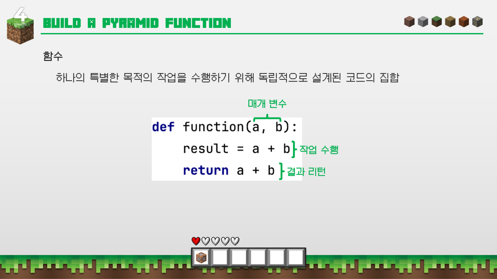
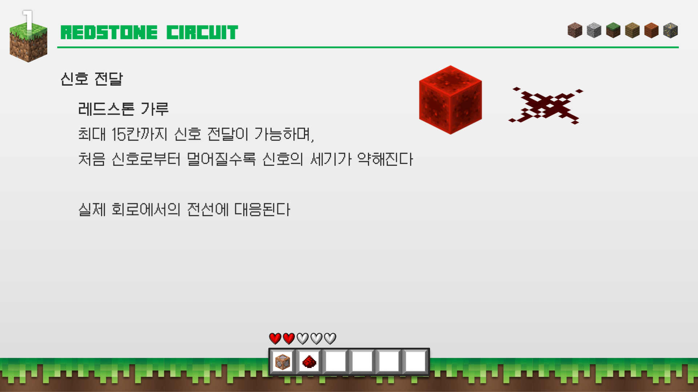
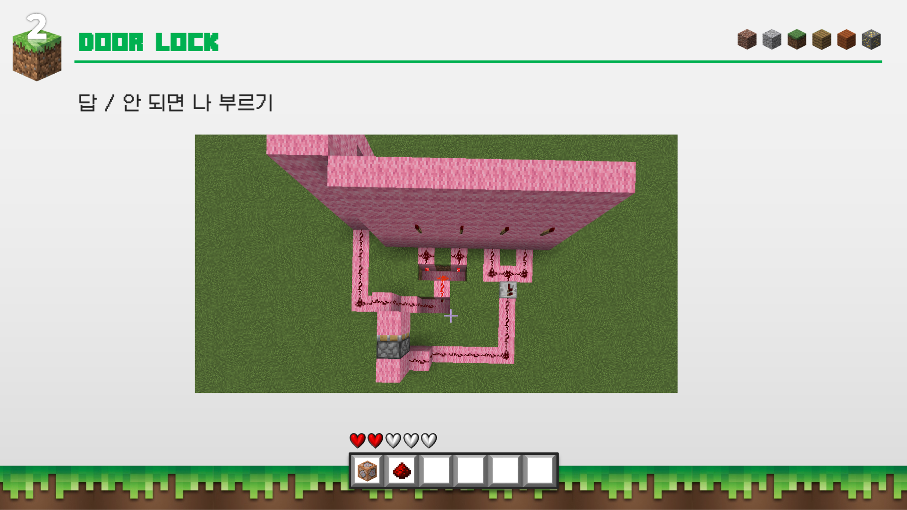

# minecraft-python
## Python을 활용한 Minecraft
---

# 소개
- Python과 Minecraft를 활용한 코딩 교육 자료
- Minecraft 1.12.2에서 동작함

# 구성
1-1. `"Hello, World!"` 출력하기
1-2. 퀴즈 : `input()` 함수를 사용하여 콘솔에서 입력받은 값 출력하기
2-1. 현재 좌표를 계속 출력하기
3-1. `n` 값을 입력하면 `n`층 피라미드를 만들어주는 `pyramind(n)` 함수 만들기
3-2. 퀴즈 : `width, height` 값을 입력하면 `width` x `height` 크기의 네더 포탈을 만들어 주는 `portal(width, height)` 함수 만들기
4-1. 눈 블럭을 밟으면 눈이 특정 시간 후에 없어지는 미니게임 만들기(바닥 떨어져유)

# 교본
pdf 파일로 첨부되어 있습니다.

